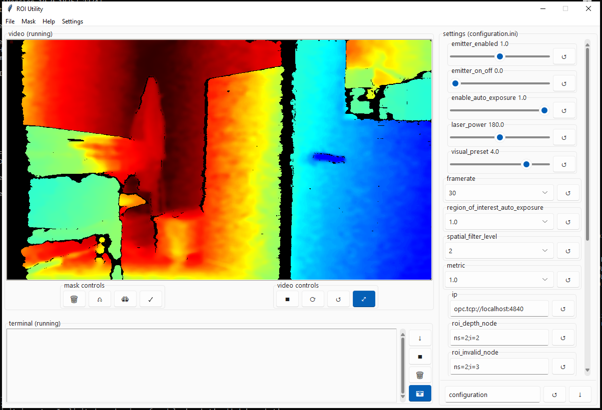

# WF-Realsense

This repository contains two major applications: The client and ROI-Utility. The client
facilitates communication between an OPCUA server and an Intel Realsense D455 depth 
camera. The ROI-Utility is a gui that allows easy configuraion of the client application. 

## Acknowledgements

 - [OPCUA library](https://github.com/FreeOpcUa/python-opcua.git)
 - [Realsense library](https://github.com/IntelRealSense/librealsense.git)


## Documentation

[Documentation](https://github.com/NickTheWhale/WF-Realsense/tree/main/docs)


## Features
#### client
- 8 server-selectable region of interests
- automatic restart in the event of server or camera disconnect
#### utility
- live depth preview
- region of interest editor
- export configuration file


## Installation
#### Currently all scripts are tested against Windows 10 Enterprise version 1909, build 18363.2274 and python 3.9.13
Install as standalone executable 

- [releases](https://github.com/NickTheWhale/WF-Realsense/releases)

Install and run from source (python 3.9)
```bash
  git clone https://github.com/NickTheWhale/WF-Realsense.git
  python -m venv venv
  .\venv\scripts\activate
  cd WF-Realsense
  python -m pip install -r requirements.txt
  cd client\app
  python main.py
```
    
## Screenshots




## Authors

- [@NickTheWhale](https://github.com/NickTheWhale)

